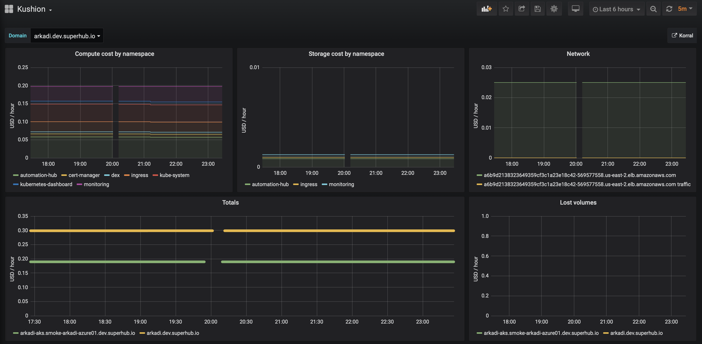

## Kubernetes cluster cost metrics

Fiber is a Kubernetes operator to manage [Korral] cost collector deployments and [Prometheus] configuration.

For each Korral [custom resource](samples/korral.yaml) installed, Fiber do two things:

1. It connects to the cluster and deploys [Korral] cost collector that is configured to export cost metrics of that cluster.
2. It changes Promethes Operator [Prometheus resource] to add cluster instance to `korral` Prometheus job.

#### Korral deployment

When new Korral resource is detected, Fiber connects to the cluster and installs [Korral]. It periodically checks for health via Korral Service `/ping` resource. If HTTP 404 is received then it will reinstall the Korral. Other return codes - including 3xx, 4xx, and 5xx, indicated the software is installed.

#### Prometheus reconfiguration.

When new Korral resource is detected (or removed), Fiber changes Prometheus custom resource to add or modify `korral` job so that cluster Kubernetes API `/api/v1/namespaces/monitoring/services/korral:9897/proxy/metrics` is scraped. As there could be many clusters providing metrics to single Prometheus, each cluster get it's own `domain` metric label that is used by [Bumper] API / UI or Grafana to filter timeseries.

#### HTTP API

Fiber optionally works with [Bumper] that bridges Prometheus metrics and Korral resources to HTTP API.

#### Status

Convergence status from the Fiber point of view (Korral `/ping`) and Prometheus point of view is posted back into custom resource under `status: {}` (are there cost metrics for the cluster? `up{job="korral", instance="<endpoint>"}`).

### Installation

[crd/korral.yaml] is Korral custom resource definition. [install/kubernetes.yaml] configures service account with restricted privileges and installs the Fiber deployment.

    kubectl apply -f crd/korral.yaml
    kubectl apply -f install/kubernetes.yaml

[samples/korral.yaml] is Korral resource example. `kubernetes.api.token` is a service account token for Fiber to install Korral [install/korral-installer-serviceaccount.yaml].

Operator will search for Prometheus resource in `$PROMETHEUS_NAMESPACE` (if env var is defined) or in a particular Korral resource namespace. The name of Prometheus resource is set via `$PROMETHEUS_RESOURCE` or `$PROMETHEUS_NAME-prometheus`; the default is `prometheus-operator-prometheus` to match Prometheus Operator `prometheus-operator` release installed by Helm.

[Prometheus]: https://prometheus.io/
[Korral]: https://github.com/agilestacks/korral
[Bumper]: https://github.com/agilestacks/bumper
[Prometheus resource]: https://github.com/prometheus-operator/prometheus-operator/blob/master/Documentation/design.md
[crd/korral.yaml]: https://github.com/agilestacks/fiber/blob/master/crd/korral.yaml
[install/kubernetes.yaml]: https://github.com/agilestacks/fiber/blob/master/install/kubernetes.yaml
[install/korral-installer-serviceaccount.yaml]: https://github.com/agilestacks/fiber/blob/master/install/korral-installer-serviceaccount.yaml
[samples/korral.yaml]: https://github.com/agilestacks/fiber/blob/master/samples/korral.yaml
